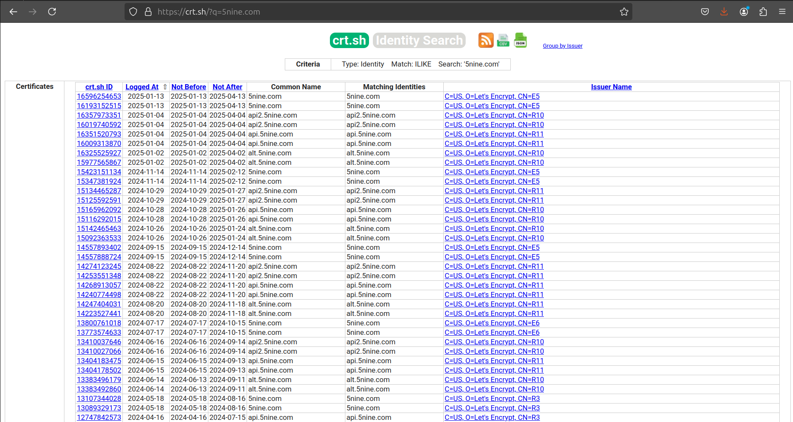
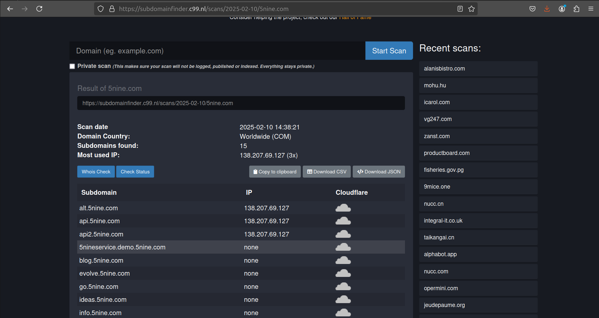
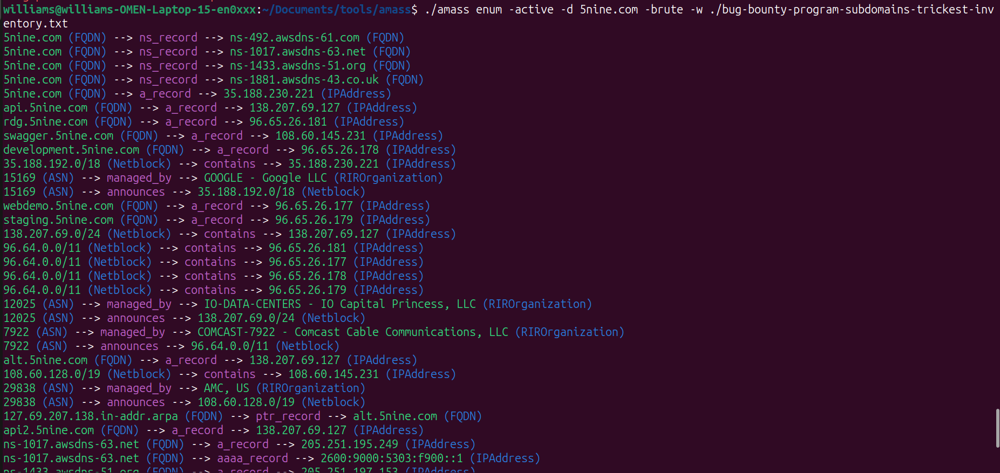

## Pengenalan

Sebelum memulai lab, baik untuk dibahas terlebih dahulu tentang apa itu DNS?

```
USER: saya mau mengunjungin google.com, IP address nya apa?
    DNS: google.com -> 8.8.8.8 
USER: IP address 8.8.8.8 itu milik siapa yah?
    DNS: 8.8.8.8 -> google.com
```

1.  DNS adalah kepanjangan dari Domain Name System.

2.  Bertugas untuk melakukan pemetaan dari IP address ke sebuah nama domain atau kebalikannya.

Berikut adalah struktur format dari nama DNS([ref](https://www.jogjahost.co.id/blog/dns-server-adalah/)):


### Apakah nama-nama domain ini perlu kita cari tahu sewaktu melakukan project _penetration testing_?

Jawaban:
Tergantung dari permintaan klien! tetapi dari kebanyakan kasus, anda tidak perlu melakukannya.

Kenapa?
Penetration Testing secara dasar sangat berfokus pada cangkupan jadi jika klien hanya mencantumkan target website "website-test.id", berarti yang di uji keamanannya hanya di domain itu saja. Anda tidak perlu mencari subdomain atau domain yang lain.

Jadi kapan pakai teknik ini?
1.  Lakukanlah jika anda melakukan _bug bounty_ karena secara umum program ini mencakup banyak aset yang harus di uji oleh _bug hunter_, jadi dengan melakukan DNS reconnaissance/enumeration _bug hunter_ bisa memilah dan memetakan aset yang dapat dia uji sesuai dengan prosedur dari programnya.
2.  Lakukanlah jika anda mau melakukan pemetaan aset eksternal perusahaan. Dengan melakukan DNS reconnaissance/enumeration anda bisa melihat aset-aset eksternal website anda yang dapat dijadikan sasaran oleh penyerang siber. Dengan pendekatan ini anda bisa menaruh prioritas mana aset digital anda yang terlebih dahulu mesti diamankan.

## Lab - 1

Untuk melakukan DNS reconnaissance/enumeration sendiri anda dapat memanfaatkan program dari _3rd party_ ini:

1.  [crt.sh](https://crt.sh/)

2.  [c99](https://subdomainfinder.c99.nl/)

Kita akan coba melakukan DNS reconnaissance/enumeration ke aset dari [acronis](https://hackerone.com/acronis?type=team) seperti yang tertulis di deskripsi program bug bounty:

```
Our main domains hosting user-facing Acronis services. All subdomains under acronis.com, devicelock.com and 5nine.com are in scope.
```

Berikut adalah hasil yang dikeluarkan oleh crt.sh:



Berikut adalah hasil yang dikeluarkan oleh c99:



Kedua _platform_ memberikan hasil yang berbeda, tetapi itu tidak terlalu bermasalah karena kita dapat menggabungkan kedua hasil tersebut menjadi satu. _Penetration Tester_ perlu untuk melakukan perbandingan dari sumber-sumber yang mereka dapatkan sebagai pembanding, agar hasil bisa lebih akurat.

Perlu diperhatikan untuk hasil yang diberikan oleh kedua website ini bisa saja tidak paling mutakhir (_up to date_) jadi kita harus memastikan subdomain yang ditemukan masih menyala atau tidak?

Kita dapat memanfaatkan program dari . _httpx_ merupakan program serbaguna untuk mengirimkan dan memanipulasi paket protokol HTTP(_HTTP request_) yang dapat membantu kita melakukan otomatisasi proses yang dijelaskan sebelumnya.

Dengan mengunduh program nya di  ini. Dalam konteks ini, dikarenakan OS yang digunakan dalam lab ini adalah ubuntu linux x64 bit. Maka versi yang dipilih adalah  httpx_1.6.10_linux_amd64.zip 


Berikut adalah subdomain yang telah dipilah dari crt.sh dan c99:

```
5nine.com
5nineservice.demo.5nine.com
alt.5nine.com
api2.5nine.com
api.5nine.com
blog.5nine.com
evolve.5nine.com
go.5nine.com
ideas.5nine.com
info.5nine.com
kb.5nine.com
salesloft.5nine.com
secure0078.hubspot.com
try.5nine.com
www.5nine.com
```

Dengan menyimpan daftar subdomain tersebut dalam sebuah file kita dapat menjalankan program _httpx_ dengan parameter berikut:

```
./httpx -status-code -title -tech-detect -list 5nine.txt 
```


Dari hasil yang diberikan oleh program kita dapat menarik kesimpulan dari 15 subdomain yang ditemukan oleh website tersebut yang masih aktif hanya 4 subdomain.

### -Latihan 1-
```
Sebagai latihan untuk lab ini, anda dapat membuat program _automation_ yang melakukan aksi berikut:

1. Program mengambil input pengguna berupa nama domain;
2. Program mengirim nama domain tersebut ke crt.sh dan menyimpan hasil yang diberikan oleh website;
3. Program memvalidasi apakah hasil yang diberikan oleh website crt.sh masih valid atau tidak dengan mengecek apakah domain masih bisa dikunjungi atau tidak.
4. Setelah validasi selesai, program mengeluarkan hasil nya ke pengguna lagi.

program bisa memakai bahasa pemrograman apapun termasuk: python, powershell, bash, php dan lain lain.
```

## Lab - 2
Untuk lab selanjutnya kita akan mencoba untuk memakai program . _Amass_ sendiri memiliki beberapa fitur yang dapat membantu melakukan _information gathering_ salah satunya adalah enumerasi DNS.

Untuk lab ini kita akan memakai pendekatan _brute force_ untuk melakukan enumerasi. Oleh karena itu kita butuh sebuah daftar atau _wordlist_ yang dapat dipakai sebagai referensi program, untuk kesempatan ini kita akan memakai 

Sesudah mengunduh file berikut anda dapat menjalankan program _Amass_ seperti berikut:



Subdomain yang valid adalah yang di label sebagai _a_record_

[Back](./)