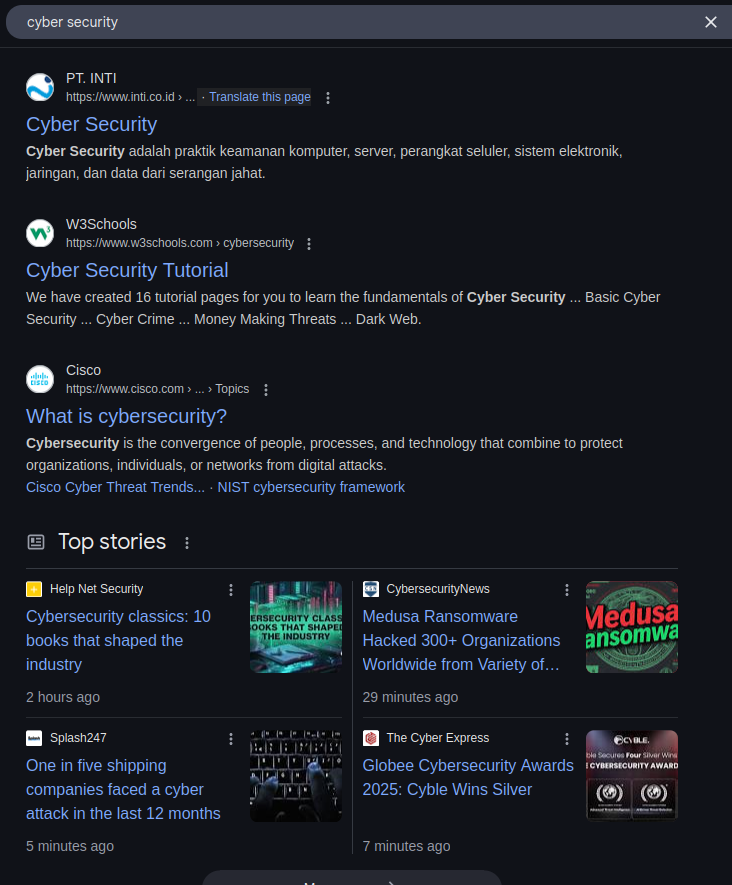
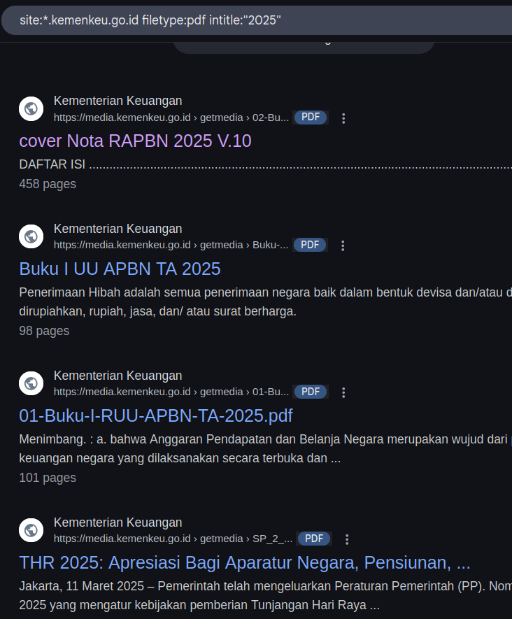
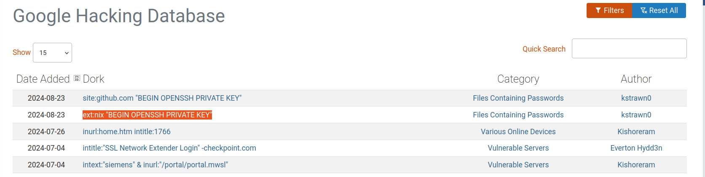
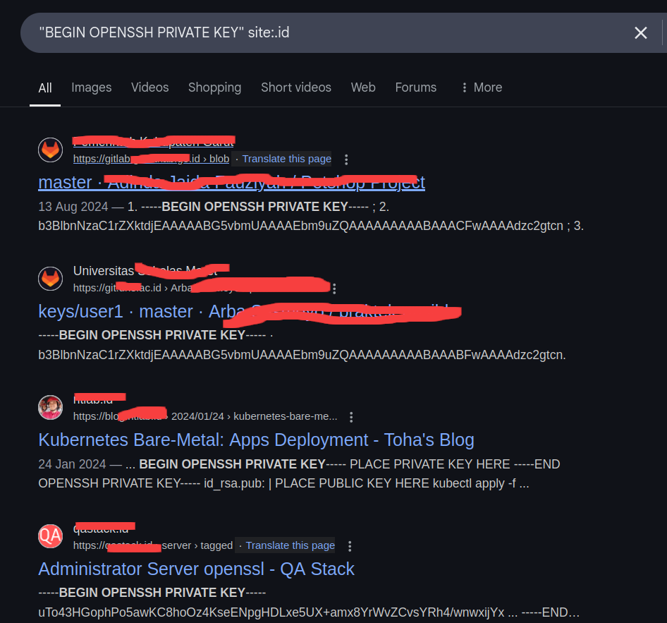

## Pengenalan

Sebelum memulai lab, baik untuk dibahas terlebih dahulu tentang apa itu GOOGLE HACKING?

```
Google hacking atau lebih sering sebagai 'Google dorking' dalam konteks 
cyber security adalah sebuah teknik pencarian di Google yang dapat membantu 
kita untuk mendapatkan informasi sensitif dari sebuah organisasi ataupun perusahaan.
```

Kenapa kita butuh teknik ini?

Karena jika kita memakai Google sendiri kita dapat memasukan sebuah "kata kunci" yang dapat dimasukan kedalam kolom pencarian seperti berikut:



Setelah memasukan "kata kunci" Google akan memberikan daftar website atau informasi yang berkaitan dengan kata-kata tersebut. Cara ini sendiri merupakan, cara yang umum dipakai oleh kebanyakan pengguna.

Tetapi apakah dengan cara ini bisa memberikan kita informasi sensitif yang dapat berguna dalam melakukan penetration testing atau red team?

Tentu saja, TIDAK !!!

Karena biasanya informasi yang bersifat 'sensitif' atau 'khusus' tidak akan dikeluarkan oleh Google jika kita memakai tipe pencarian seperti yang ada digambar diatas. 

## Operator Google Dorking

Google dorking sendiri memakai 'syntax' atau 'operator' yang dapat mengkhususkan pencarian dari pengguna.

Contohnya:

Pengguna ini ingin mencari file pdf yang pernah dibagikan oleh kemenkeu di tahun 2025. Pengguna bisa memasukan operator berikut:

```
site:*.kemenkeu.go.id filetype:pdf intitle:"2025"
```



catatan: hasil pencarian yang tertera di gambar diatas merupakan informasi publik

Mari kita bedah sedikit tentang operator yang telah dimasukin:

- site:*.kemenkeu.go.id

Operator untuk memfilter berdasakan kriteria dari nama domain yang dipakai oleh website. Dengan menambahkan * (wildcard) itu artinya pengguna ingin mendapatkan hasil dari subdomain yang masih satu domain dengan kemekeu.go.id.

- filetype:pdf

Operator untuk memfilter berdasarkan kriteria tipe file yang ditampilkan oleh website. Dalam kasus ini pengguna ingin mencari file berbentuk .pdf karena laporan biasanya di format dalam bentuk tersebut.

- intitle:"2025"

Operator untuk memfilter berdaskan kriteria judul yang ditampilan di halaman website. Dalam kasus ini pengguna ingin mencari halaman website / laporan yang ada tulisan "2025".

## Google Hacking Database(GHDB)

Jika anda ingin mencari lebih banyak referensi tentang bagaimana Google dork dapat dimanfaatkan untuk mencari data bocor atau celas sebuah keamanan. Anda bisa mengunjungi [GHDB](https://www.exploit-db.com/google-hacking-database)

Kita akan mencoba mengambil Google dork berikut:



Lalu kita akan memodifikasi dork nya dengan menambahkan operator site: lagi untuk memfilter hasil agar hanya mengeluakan website yang domainnya berasal dari Indonesia menjadi "BEGIN OPENSSH PRIVATE KEY" site:.id



Mari kita telaah hasil yang diberikan oleh dork yang telah dimodifikasi.

- "BEGIN OPENSSH PRIVATE KEY" 

Ini merupakan salah satu bentuk lain dari dork yang telah dijelaskan sebelumnya. Dengan memakai dork ini Google harus memberikan website dengan tulisan yang ada dalam petik dua dan harus sama persis.

- site:.id

Artinya Google harus memberikan website yang dimana domain website nya ada .id yang merupakan berasal dari indonesia.

Kenapa memakai kata kunci "BEGIN OPENSSH PRIVATE KEY" karena ini merupakan salah satu komponen dari 'private key' SSH. Apa itu 'private key'? simpel nya komponen ini adalah bisa kita anggap sebagai password untuk bisa masuk ke server dan di kasus ini kita memanfaatkan keteledoran dari sistem admin yang suka menaruh sembarang hal-hal sensitif di website nya dengan beranggapan informasi tersebut tidak akan bisa ditemukan kecuali dia sendiri.

Tapi apakah hasil yang diberikan Google ini 100% valid ?

<b>Tentu saja TIDAK!<b>

Kita sebagai pentester harus melakukan validasi apakah temuan yang ada di Google dork ini valid atau tidak. Karena bisa saja 'private key' yang kita temukan sudah kedaluwarsa atau diganti dengan yang baru yang belum terindex oleh Google crawler.

Semoga dengan penjelasan ini anda sadar bahwa di dunia cyber security ini kita bukan hanya sekedar copy-paste dan mengklaim itu temuan. Perlu adanya validasi dan analisa lebih lanjut efek dari temuan yang ada di kasus ini.

## Referensi Tambahan

Jika anda tertarik untuk mempelajari Google dork anda juga dapat mengunjungi [Github](https://github.com/Tobee1406/Awesome-Google-Dorks) berikut untuk melihat syntax apalagi yang dapat dimanfaatkan lagi.

[Back](./)